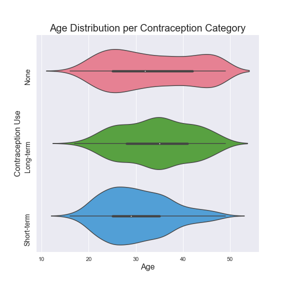
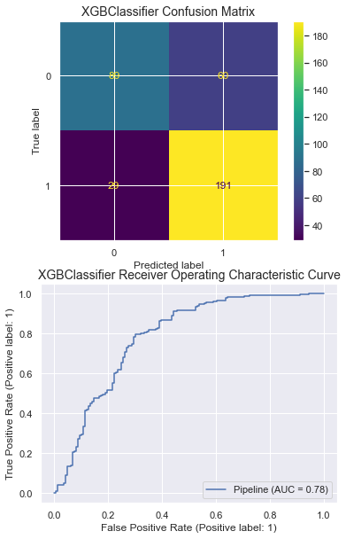
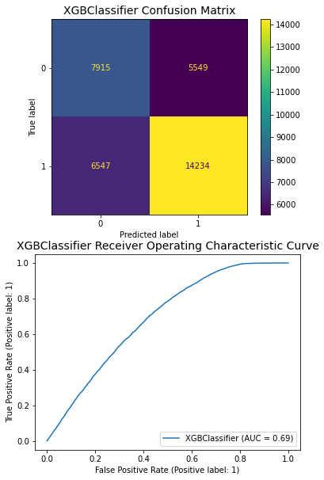

# Contraceptive Method Choices of Married Women in Indonesia
  
## Overview  
In this project, we examine a dataset of contraceptive methods used by married Indonesian women to see what insights and predictions can be made based on various demographic and socioeconomic variables.  

  
  
## Motivation  
To make informed recommendations for further action to public health officials in order to improve the welfare of mothers and children. We hope to have an impact in empowering healthcare autonomy of female citizens in Indonesia, while reducing unwanted pregnancy, abortion rates, birth complications, & infant and maternal mortality rates.  
  
## Data  
Our [dataset](https://archive.ics.uci.edu/ml/datasets/Contraceptive+Method+Choice) comes from the [UC Irvine Machine Learning Repository](https://archive.ics.uci.edu/ml/index.php), used with permission.  Note that the full datasets are not included in this repository as they require additional permission to publish.
  
### Features Examined  
Feature Name             |  Type         |     Values  
:------------------------|:--------------|-------------:  
Woman's age              | numerical     |   
Woman's education        | categorical   | 1 = low, 2, 3, 4 = high  
Husband's education      | categorical   | 1 = low, 2, 3, 4 = high  
Number of children       | numerical     |   
Wife's religion          | binary        | 0 = Non-Islam, 1 = Islam  
Wife's now working?      | binary        | 0 = Yes, 1 = No  
Husband's occupation     | categorical   | 1, 2, 3, 4  
Standard-of-living index | categorical   | 1 = low, 2, 3, 4 = high  
Media exposure           | binary        | 0 = Good, 1 = Not good  
  
### Target Variable  
Feature Name             |  Type           |     Values  
:------------------------|:----------------|-------------:  
Contraceptive method used| class attribute |  1 = No-use   2 = Long-term method   3 = Short-term method  
  
## Methods  
Our methodology implements the CRISP-DM model for exploratory data analysis, cleaning, modeling, and evaluation.  
We leverage machine learning models from [Scikit-learn](https://scikit-learn.org/stable/) to determine the relationship between the features and the target variable. We also perform statistical analysis via [SciPy Stats](https://docs.scipy.org/doc/scipy/reference/stats.html) to further make inferences on the data.  
Other tools used include Python, NumPy, and Pandas. Visualizations were created with MatPlotLib and Seaborn.  
  
## Approach
After verifying data integrity for our 1987 data, we delved right into EDA and data visualization. We examined the nuances of various dependent variables on the target variable. Based on our findings, we engineered new variables and bucketized contraption methods into a binary variable (with 0 meaning no contraception and 1 meaning uses long-short or short-short contraception). We performed regression analysis to determine the relationship between various variables. We then tested numerous classifiers to determine our best model, correcting for class imbalance and optimizing for recall accuracy. As an extension, we ran our fitted classifiers against the 2017 data to further evaluate our model.
  
## Analysis
The 1987 test data show that a slight skew toward younger women and older women who do not use any contraception - we hypothesize that younger women may not have started using contraception, and older women were not exposed to contraceptive methods at an early enough age:  

Perhaps unsurprisingly, the number of children a woman has is also correlated to contraception use, but only up until a certain point:  

The biggest predictor of contraception use is the Level of Education attained by the wife:  
  

Similarly, the wife's Employment Status, Husband's Education Level, Standard of Living, and Media Exposure also had a positive correlation (not that the Media Exposure variable is defined inversely, 1 is poor exposure):  

Religion had a negative impact on use of contraception, which is not surprising:  

One of our engineered features - Neet Wife (Not Educated, Employed or in Training) - also showed a negative impact, which is as expected:  

Our other engineered feature - Wife More Educated (than the husband) - showed a positive impact:  

  
## Modeling
We tested Logistic Regression, Random Forest, and XGBoost; tested dummying the `children` variable; tested Tomek Links resampling; and tuned hyperparameters via GridSearchCV.
Our best model uses an XGBClassifier:

Running against the cleaned and prepared 2017 data, we were able to obtain acceptable results:

  
## Conclusion
After running model feature selection, it appears that `age` and `# of children` are a strong indicator for a woman’s use of contraception.  
Our best model performed with and average recall of .65, F1 score of .65, and ROC-AUC of .69.  
The model also suggests that a woman’s `education` is a strong indicator of the likelihood for her to select a long-term contraceptive method.  
It would be beneficial to direct public health initiative around these factors.
  
## Further Actions  
After submitting an application, we have received authorization from [the Demographic and Health Surveys program (DHS)](https://www.dhsprogram.com/Countries/Country-Main.cfm?ctry_id=17&c=Indonesia&Country=Indonesia&cn=&r=4) to access the original NICPS full datasets, which include more attributes and much larger sample sizes.  
  
The original datasets will allow us to find deeper insights, as well as test our model on the population of Indonesia in subsequent years.  
  
We would like to see what other targets may be predicted on to make further public health policy suggestions.  
  
We would like to further optimize our model for a higher average recall, and continue to clean, implement features from, and predict on data from subsequent years, as well as evaluate against populations of other contries.  

## Repository Structure
    .
    ├── code/                                     # python helper functions file
        ├── functions.py                          # helper functions
    ├── crisp_dm_process/                         # initial EDA and model notebook files 
        ├── Initial_EDA.ipynb                     # notebook file with data exploration, insights, and takeaways  
        ├── model_fitting_and_tuning.ipynb        # notebook file for modeling trials and process
        ├── model_predict_1987_vs_2017.ipynb      # notebook file for extended analysis on fitting our trained models on 2017 data
    ├── data/                                     # project datasets
    ├── images/                                   # visualizations; images for notebooks, README, and presentation slides
    ├── Contraception_Indonesia_FINAL.ipynb       # primary project notebook  
    ├── Contraception_Indonesia_Presentation.pdf  # presentation slides
    ├── README.md                                 # this readme
    └── relevant_resources/                       # additional resources for 1987 data

  
## Bibliography  
1. Dataset Origin:  
  
                 the 1987 National Indonesia  
                Contraceptive Prevalence Survey  
2. Creator: Tjen-Sien Lim (limt@stat.wisc.edu)  
3. Donor:   Tjen-Sien Lim (limt@stat.wisc.edu)  
4. Date:    June 7, 1997
5. Web Source: https://archive.ics.uci.edu/ml/datasets/Contraceptive+Method+Choice                
  

Authors  
  
Alexander Xin & Mike Flanagan  
    
[GitHub](https://github.com/eggrollofchaos) | [GitHub](https://github.com/mike-flanagan/)  
[LinkedIn](https://linkedin.com/in/waximus) | [LinkedIn](https://www.linkedin.com/in/mike-flanagan-data/)
